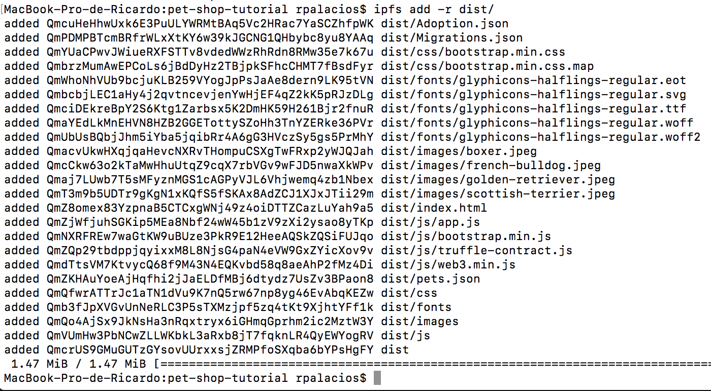
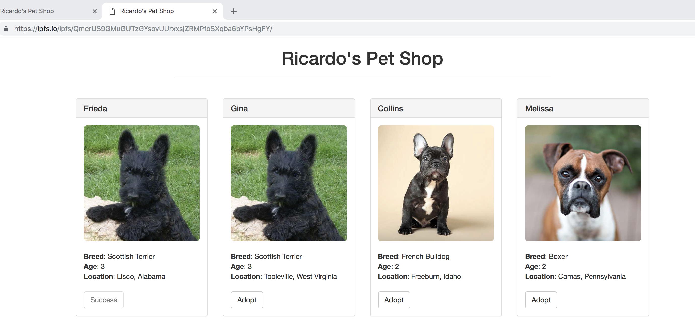
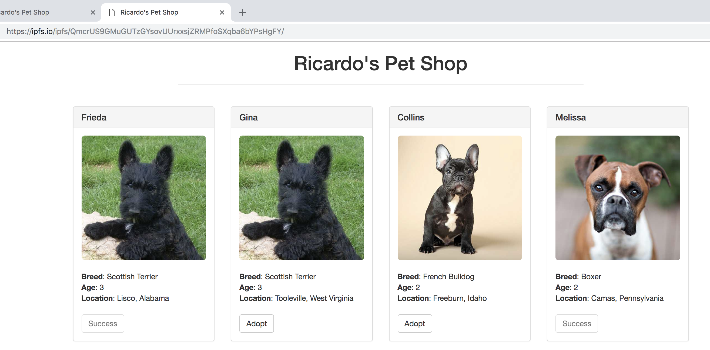

# PEC 2

## Ejercicio 2 - IPFS

> En el proyecto [pet-shop-tutorial](https://github.com/rpmaya/uah-ethereum/tree/master/Pec2/Ejercicio2/pet-shop-tutorial), modificamos el fichero [./src/index.html](https://github.com/rpmaya/uah-ethereum/blob/master/Pec2/Ejercicio2/pet-shop-tutorial/src/index.html), para cambiar el nombre Pete por el de Ricardo (línea 8).

> Instalamos IPFS, inicializamos el repositorio y el demonio siguiendo estas [instrucciones](https://docs.ipfs.io/introduction/usage/)

> Para desplegarlo, primero creamos el directorio "dist/" dentro del proyecto y copiamos ahí el contenido de "src/" y de "build/contracts/"

> cd pet-shop-tutorial
> mkdir build
> rsync -r src/ dist/
> rsync -r build/contracts/ dist/

> Realizamos un pequeño cambio en src/app.js, para que pueda localizar pets.json, es decir, en la línea 7, modificamos la ruta en .getJSON(../pets.json) por .getJSON(./pets.json)

> Entonces subimos el contenido de "dist/" a IPFS

> Donde el hash del raíz de la aplicación es "QmcrUS9GMuGUTzGYsovUUrxxsjZRMPfoSXqba6bYPsHgFY" 

> A continuación publicamos el nombre:

> Accedemos a la aplicación a través de IPFS:

> Intentamos adoptar a Melisa

> Y comprobamos que así ha sido!

