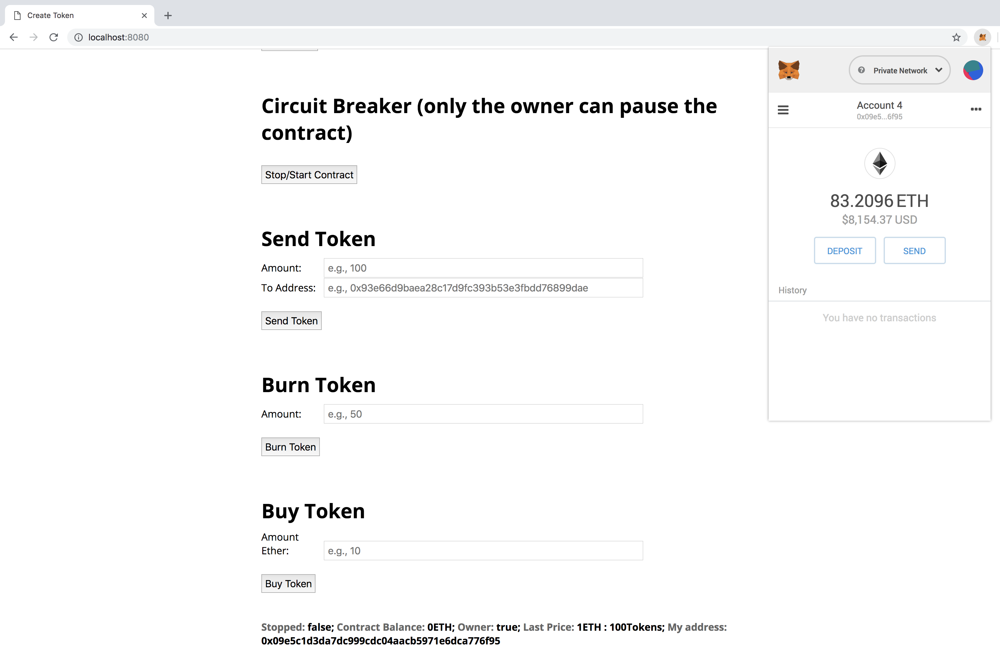
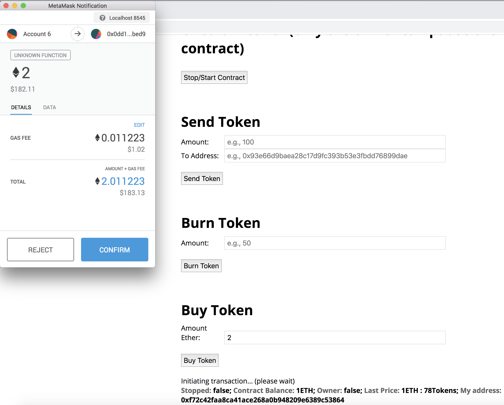

# PEC 3

## Merchant Token

> En el PEC3 de Diseño y Desarrollo, hemos creado un Smart Contract [merchant](https://github.com/rpmaya/uah-ethereum/tree/master/Pec3/merchant), que permite la creación y edición ("name", "symbol" y "supply") de un token propio, con las funcionalidades básicas de:

1. Send 
2. Buy
3. Mint (only by the owner)
4. Burn

> Para arrancar el smart contract en ganache-cli (blockchain local):

1. Ejecutamos ganache-cli con una regla nemotécnica para obtener siempre las mismas direcciones
```
# ganache-cli -m "El perro de San Roque”
```
2. Arrancamos ethereum-bridge (clonado previamente) para el uso de Oráculos:
```
# cd ethereum-bridge/
# node bridge -a 9 
```
(Toma la address 10)

3. Compilamos y desplegamos nuestros smart contracts (para desplegar requiere que esté levantado ganache-cli en el 8545 y el servicio de ethereum-bridge):
```
# truffle compile && truffle migrate
```

4. Arrancamos un servidor web local:
```
# npm run dev
```

5. Podemos acceder a nuestro servidor web local en 
http://localhost:8545

> A continuación pasamos a detallar cada una de las partes:

INTERFAZ:


> Donde se tiene que:

1. La aplicación ejecuta en un servidor local: http://localhost:8080
2. Desde un navegador se realiza una carga correcta de la aplicación
3. Interacción con la aplicación (botones y campos de texto)
4. Se muestra la address actual (en el footer de la página)
5. Se refresca automáticamente la web cuando se cambia de address
    -   En [index.js](https://github.com/rpmaya/uah-ethereum/blob/master/Pec3/merchant/app/scripts/index.js) añadimos el siguiente código [FAQ Metamask](https://github.com/MetaMask/faq/blob/master/DEVELOPERS.md#ear-listening-for-selected-account-changes):
```
var accountInterval = setInterval(function() {
    if (web3.eth.accounts[0] !== account) {
      account = web3.eth.accounts[0];
      window.location.reload();
    }
  }, 100);
```
6. Firmar transacciones usando MetaMask
Donde al introducir el número de ether a enviar para comprar Token, se nos muestra la confirmación en Metamask y se informa al usuario con "Initiating transaction...(please wait) justo debajo del botón "Buy Token"
   


7. Guiar al usuario
Una vez realizada la transacción, se le informa al usuario con "Buy Complete!" en el mismo lugar.


LIBRERÍA
1. Se usa la librería [ConvertLib.sol](https://github.com/rpmaya/uah-ethereum/blob/master/Pec3/merchant/contracts/ConvertLib.sol), para ello añadimos:
   -  En [Tokens.sol](https://github.com/rpmaya/uah-ethereum/blob/master/Pec3/merchant/contracts/Tokens.sol):
```
import "./ConvertLib.sol";
...
uint amount = ConvertLib.convert(_amount, price);
...
```
  - En [2_deploy_contracts.js](https://github.com/rpmaya/uah-ethereum/blob/master/Pec3/merchant/migrations/2_deploy_contracts.js):
```
var ConvertLib = artifacts.require('./ConvertLib.sol')
...
module.exports = function (deployer, network, accounts) {
  deployer.deploy(ConvertLib)
  deployer.link(ConvertLib, Tokens)
  ...
``` 

SMART CONTRACTS
1. Uso de herencia
   - Heredamos de los smart contacts [usingOraclize.sol](https://github.com/rpmaya/uah-ethereum/blob/master/Pec3/merchant/contracts/usingOraclize.sol) y [Owned.sol](https://github.com/rpmaya/uah-ethereum/blob/master/Pec3/merchant/contracts/Owned.sol), para ello añadimos en [Tokens.sol](https://github.com/rpmaya/uah-ethereum/blob/master/Pec3/merchant/contracts/Tokens.sol):
```
import "./Owned.sol";
import "./usingOraclize.sol";
...
contract Tokens is Owned, usingOraclize {
...
}
```  
2. Implementación de parada de emergencia
   - En [Tokens.sol](https://github.com/rpmaya/uah-ethereum/blob/master/Pec3/merchant/contracts/Tokens.sol):
```
bool private stopped = false;
modifier notStopped {if(!stopped) _;}
...
function breaker() public onlyOwner {
        stopped = !stopped;
}
//En las funciones que queramos parar o reactivar añadimos "notStopped" tal que, por ejemplo:
function X (...) public notStopped {...}
```
3. Medidas de seguridad ante ataques típicos
   - En [Tokens.sol](https://github.com/rpmaya/uah-ethereum/blob/master/Pec3/merchant/contracts/Tokens.sol), cuando vamos a realizar una transferencia aplicamos los siguientes requires:
```
function _transfer(address _from, address _to, uint256 _value) internal notStopped {
        // Prevent transfer to 0x0 address. Use burn() instead
        require(_to != 0x0);
        // Check if the sender has enough
        require(balanceOf[_from] >= _value);
        // Check for overflows
        require(balanceOf[_to] + _value >= balanceOf[_to]);
        ...
```
4. TODO: Comentar patrones de actualización (no es necesario implementar)
5. Comentarios
   - En nuestro Smart Contract [Tokens.sol](https://github.com/rpmaya/uah-ethereum/blob/master/Pec3/merchant/contracts/Tokens.sol), realizamos comentarios para las funciones públicas tal que, por ejemplo:
```
/**
     * @dev Destroy tokens: Remove `_value` tokens from the system irreversibly
     * @param _value the amount of tokens to burn
     * @return success If the transaction was fine.
     */
    function burn(uint256 _value) public notStopped returns (bool success) {...}
```
TESTING
1. TODO (Justificar, comentar y mostrar pantallazo con los tests pasados)

EXTRAS
1. Uso de Oráculos
   - Como vamos a ejecutar sobre una blockchain de test local (ganache-cli), vamos a necesitar ethereum-bridge, para ello lo clonamos a nuestro local tal que:
```
git clone https://github.com/oraclize/ethereum-bridge.git
```
  - Para lanzar nuestra blockchain local siempre con las mismas direcciones ejecutamos
```
ganache-cli -m "<texto cualquiera>"
```
Por ejemplo, en nuestro caso (es útil para Metamask también, solo importamos cuentas una vez):
```
ganache-cli -m "El perro de San Roque"
```
  - Ahora lanzamos ethereum-bridge con la última dirección, la décima del array:
```
cd ethereum-bridge/
node bridge -a 9 
```
  - Esperamos hasta ver algo como (y guardamos el valor de OAR):
```
Please add this line to your contract constructor:

OAR = OraclizeAddrResolverI(0x6f485C8BF6fc43eA212E93BBF8ce046C7f1cb475);
```

 - Ahora descargamos [OraclizeAPI](https://github.com/oraclize/ethereum-api/blob/master/oraclizeAPI_0.4.25.sol) y lo renombramos como "usingOraclize.sol" dentro de nuestro directorio de contratos.

- Por último, escribimos el siguiente código en [Tokens.sol](https://github.com/rpmaya/uah-ethereum/blob/master/Pec3/merchant/contracts/Tokens.sol):
```
import "./usingOraclize.sol";
...
contract Tokens is usingOraclize ... {
...
  constructor(...) public {
        OAR = OraclizeAddrResolverI(0x6f485C8BF6fc43eA212E93BBF8ce046C7f1cb475); // For testing only, remove in production
        ...
}
  ...
  function __callback(bytes32 _myid, string _result) public {
        require (msg.sender == oraclize_cbAddress());
        bytes memory tempEmptyStringTest = bytes(_result); // Uses memory
        if (tempEmptyStringTest.length > 0) //Just updates the price if receives data from Oracle, otherwise keeps the last value
            price = parseInt(_result);
    }  

  function update() public payable {
        oraclize_query("URL","json(https://min-api.cryptocompare.com/data/price?fsym=ETH&tsyms=EUR).EUR");
    }
```
  - Es decir, consulta el precio ETH/EUR en min-api.cryptocompare.com para mantener el precio de nuestro Token fijo al EURO. Por ejemplo, si 1ETH vale 80EUR, al comprar nuestro Token con ETH, para cada ETH recibiremos 80 Tokens. Por tanto, si compráramos 2ETH, recibiríamos 160 de nuestros Tokens (si el precio ETH/EUR es de 80). El precio ETH/EUR se actualiza antes de cada compra.